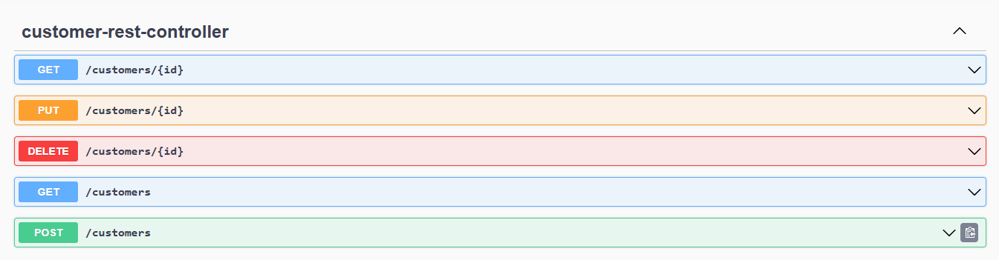

<h1 align="center">Digital Banking</h1>

  <strong>L'application aura pour objectif de fournir une vue d'ensemble des finances personnelles de l'utilisateur en centralisant les informations relatives à ses différents comptes bancaires. Les fonctionnalités principales incluront :
Création et gestion de comptes (courants, épargnes)
Enregistrement des opérations (débits, crédits)
Catégorisation des dépenses
Suivi du budget
Génération de rapports</strong>

---

   
  

   

   
 

   

   
 

   
  

   
  

   
  

   
  

   
  

   
  

   
  

   
  

   
  

   
  

